
<h1 align="center">招生管理系统</h1>

## 简介
Spring Boot 703招生管理系统：角色分为管理员、学生；功能包括学生信息管理、专业信息管理、招生公告管理、在线报名、成绩查询，支持权限控制，简化招生流程，提高管理效率。    --计算机毕业设计源码；毕设源码；java毕业设计源码

## 联系方式

<h3 align="center">获取完整代码与数据库文件 + 微信：deepguan QQ: 86050149 QQ群: 783742310</h3>

<h3 align="center">可帮忙远程部署 包运行成功！提供远程部署、修改代码、设计文档指导、代码讲解等服务！</h3>

## 功能介绍（完整见运行截图）
管理员：基本功能包括登录、注册和退出，能够管理学生信息、专业信息、招生公告和系统设置，并对不同用户角色进行权限设置。主页提供主导航栏和系统公告，管理专业报名和录取通知。可以查看和编辑用户的个人信息，重置密码，发布和编辑招生计划，上传轮播图和学校相关图片，在后台进行数据统计分析以优化招生策略，提高系统运行的效率和安全性。

学生：可以通过系统进行注册和登录，查阅以及修改个人信息。能够查看招生信息、专业信息及相关招生公告，线上提交报名申请及上传相关资料。个人中心允许查看个人学业信息、修改密码，并接受录取通知和其他重要系统信息。界面设计简洁直观，提供便捷的导航和操作框架，支持在线查看及下载与管理相关文档资料，帮助用户高效地完成个人信息管理和报名申请。

教师或招生工作人员：可以登录系统查看学生报名信息，管理课程安排及成绩查询。能够对学生报名进行统一审核和发布录取通知，且能筛选和查询专业报名状态和信息。界面提供专门的导航项，用于管理和审查学生提交的信息，支持删除、修改和通知功能。通过系统集成的工具进行数据管理和报表生成，便于分析和决策，提升招生管理和课程安排的便捷性及准确性。

## 运行截图
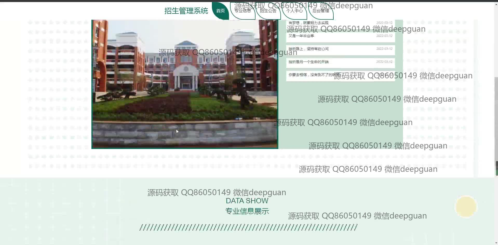
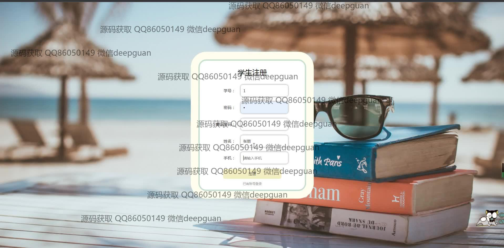
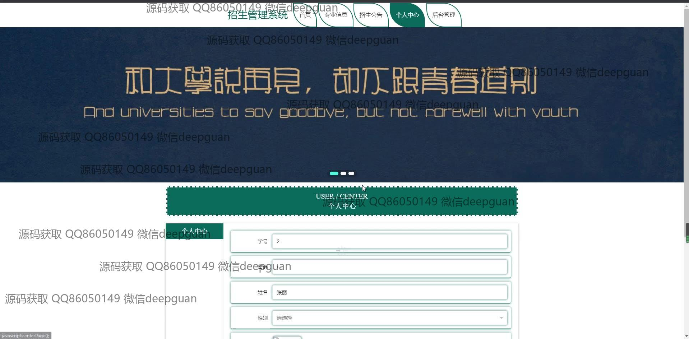
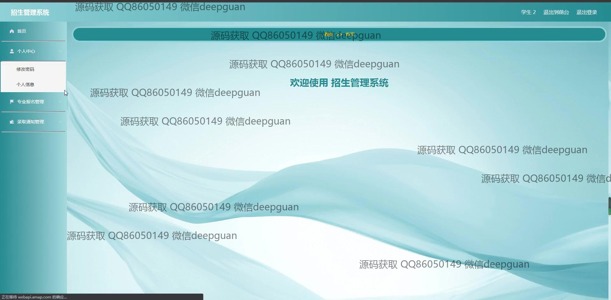
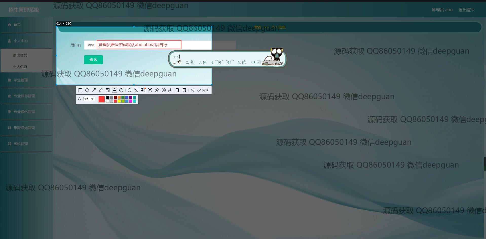
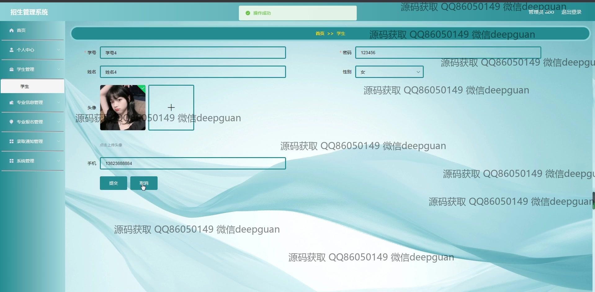
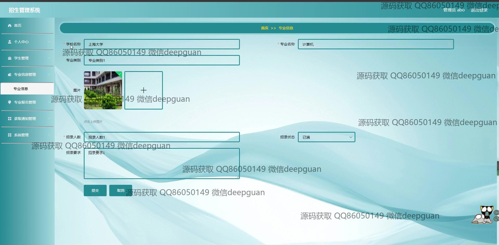
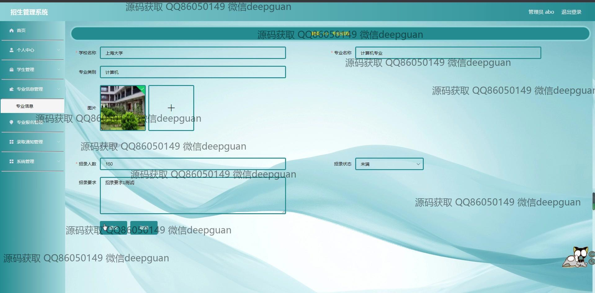
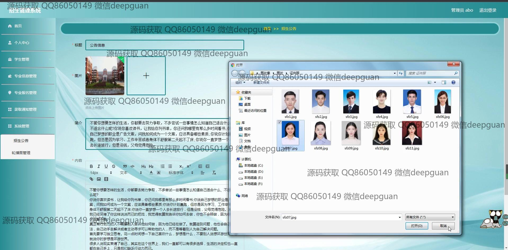

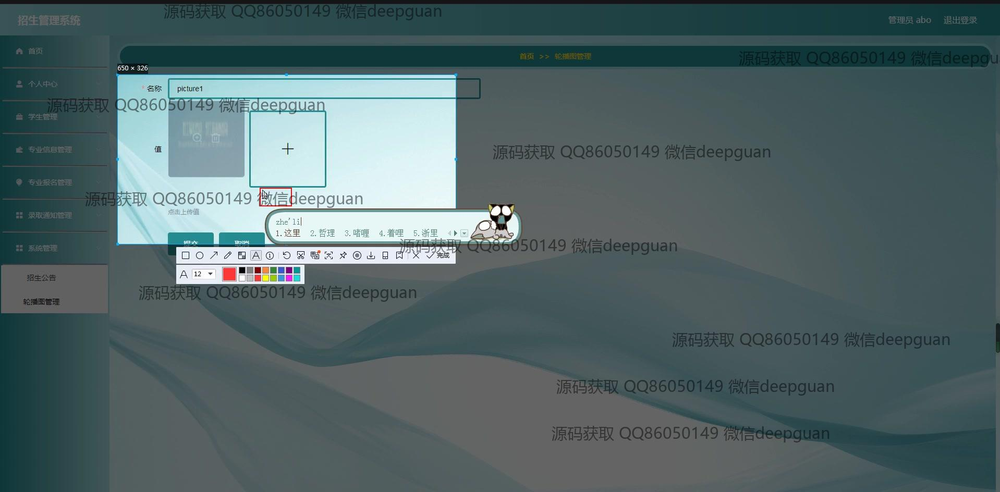
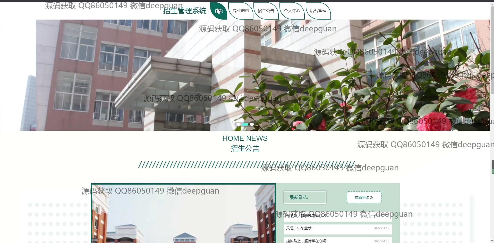
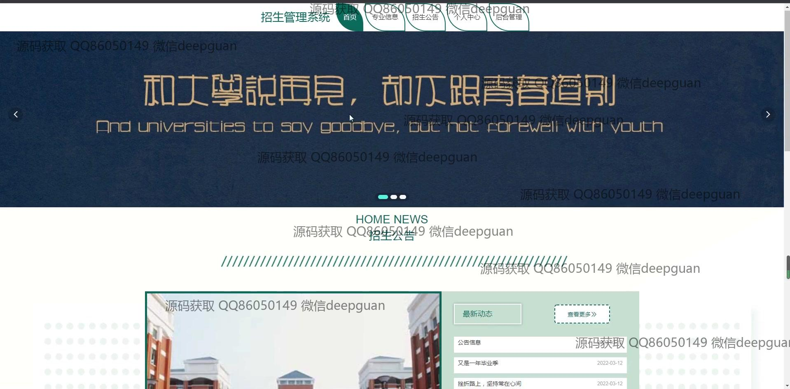
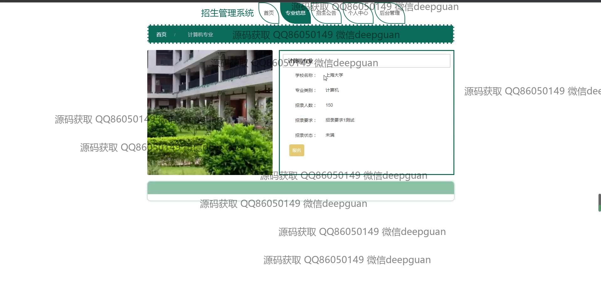
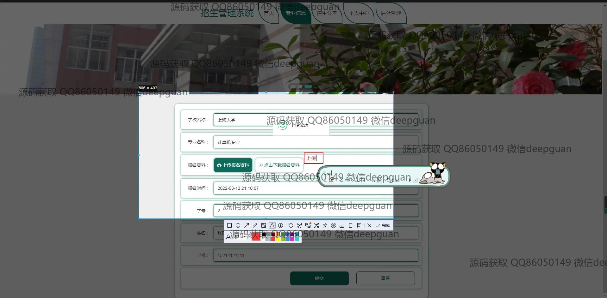
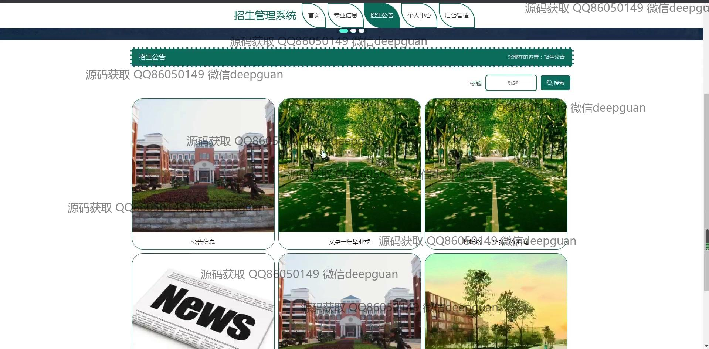
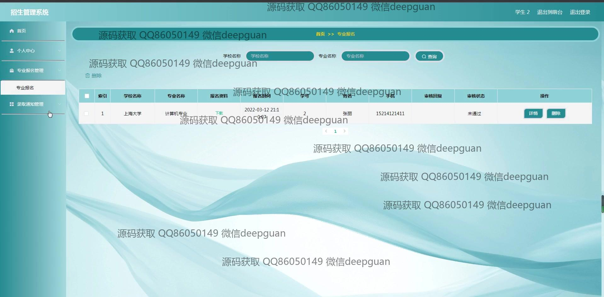
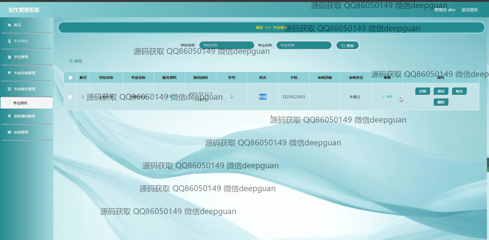
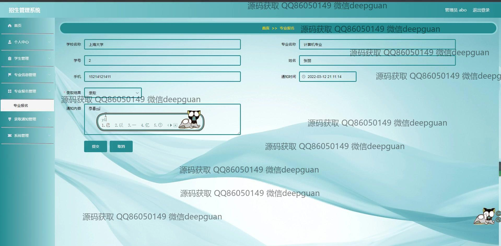

本代码来源于网络,仅供学习参考使用!

